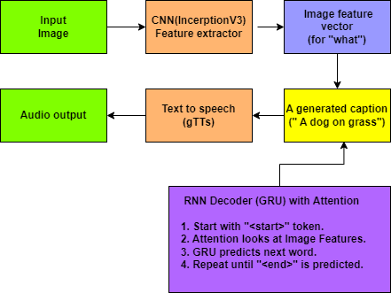

# VisionVoice– CNN + RNN + Attention

## 1. Introduction

### Problem Statement
The world is increasingly visual, with social media, news, and daily life revolving around images. For the millions of people worldwide who are blind or have severe visual impairments, this visual world remains largely inaccessible. A simple task like understanding a photo shared by a friend, reading a sign in an image, or grasping the context of a news article's picture becomes a significant challenge.

This project aims to solve this problem by creating an AI-powered system that can "see" an image and describe its contents in a clear, spoken sentence. The goal is to build a bridge between visual content and those who cannot see it, effectively acting as an "eye for the blind."

### Real-World Importance
The significance of this project extends beyond a technical exercise; it's about leveraging artificial intelligence for accessibility and social good.

-   **Inclusivity:** It allows visually impaired individuals to participate more fully in the digital world, understanding the context of images on social media, websites, and applications.
-   **Independence:** Such a tool can enhance daily independence. Imagine pointing a smartphone camera at an object or scene and getting an audio description—this could help in navigation, shopping, or identifying objects.
-   **AI for Good:** This project is a prime example of how advanced AI techniques like deep learning, computer vision, and natural language processing can be harnessed to address real-world human challenges and improve quality of life. Facebook's automatic alt-text feature is a commercial example of this technology in action.

## 2. How the Solution Works

The core idea is to combine two powerful types of neural networks—a Convolutional Neural Network (CNN) for "seeing" and a Recurrent Neural Network (RNN) for "describing"—and enhance their collaboration with an Attention Mechanism.

### Overall Workflow
The process can be broken down into a pipeline of distinct steps:

1.  **Input:** The system takes a single image as input.
2.  **Feature Extraction (The "Seeing" Part):** The image is fed into a pre-trained CNN (InceptionV3). The CNN processes the image through its layers and extracts a rich set of high-level features—essentially, a numerical representation of the image's content (e.g., identifying shapes, objects, textures). We don't use the part of the CNN that classifies the image; instead, we take the feature map from a layer just before classification.
3.  **Caption Generation (The "Describing" Part):** This is a step-by-step process handled by the RNN (specifically, a GRU) and the Attention Mechanism.
    *   The RNN starts with a special `<start>` token.
    *   At each step, the **Attention Mechanism** "looks" at different parts of the image's feature map to decide which part is most relevant for predicting the *next* word.
    *   The RNN takes the previously generated word and the "attended" image features (called a context vector) as input to predict the next word in the sentence.
    *   This process repeats until the RNN predicts a special `<end>` token, signaling that the caption is complete.
4.  **Text-to-Speech Conversion:** The generated text caption (e.g., "a dog is running on the grass") is passed to a Text-to-Speech (TTS) engine (like Google's gTTS).
5.  **Output:** The TTS engine converts the text into an audio file, which is then played, providing the user with a spoken description of the image.

### High-Level Flowchart

Here is an Model Workflow Diagram illustrating the pipeline:





## 3. Dataset Details

### Flickr8k Dataset
This project uses the **Flickr8k dataset**, a popular benchmark for image captioning tasks.

-   **Structure:** It contains **8,091 unique images** collected from the Flickr website. Each image is paired with **five different captions** written by human annotators. This provides a total of over 40,000 captions.
-   **Why it's chosen:**
    *   **Multiple Captions:** Having five captions per image is crucial. It provides variety in description and helps the model learn that there isn't just one "correct" way to describe an image, making it more robust.
    *   **Manageable Size:** While smaller than other datasets like MS COCO, Flickr8k is large enough to train a decent model but small enough to be manageable on a single GPU (like in Google Colab or Kaggle), making it ideal for learning and experimentation.

### Preprocessing Steps

Raw data is never clean enough for a neural network. We must perform several preprocessing steps on both the images and the text captions.

#### Caption Preprocessing
The goal is to standardize the text data.

1.  **Load Captions:** The captions are loaded from a text file (`captions.txt`).
2.  **Lowercase Conversion:** All text is converted to lowercase (e.g., "A dog" and "a dog" are treated as the same). This reduces the size of our vocabulary and simplifies the learning process.
3.  **Punctuation Removal:** Punctuation marks (like `.`, `,`, `!`) are removed as they don't add significant meaning for this task and would otherwise be treated as unique words.
4.  **Remove Numeric Values & Short Words:** Numbers and single-letter words (e.g., "a") are removed to further clean the vocabulary and focus on more descriptive words.
5.  **Tokenization:** The entire corpus of cleaned captions is used to build a vocabulary of the most frequent words. In this project, the vocabulary is limited to the top 5,000 words. Any word not in this vocabulary is replaced with a special `UNK` (unknown) token.
6.  **Add Start/End Tokens:** Every caption is prepended with a `<start>` token and appended with an `<end>` token. This is critical for the RNN decoder:
    *   `<start>` signals the beginning of the caption generation process.
    *   `<end>` tells the model when the sentence is complete.
7.  **Padding:** Since neural networks require inputs of a fixed size, and our captions have varying lengths, we use padding. We find the length of the longest caption and "pad" all shorter captions with zeros until they reach this maximum length. This ensures that every caption sequence fed into the model has the same dimension.

#### Image Preprocessing
Images also need to be standardized before being fed into the CNN.

1.  **Resizing:** The InceptionV3 model was trained on images of size **299x299 pixels**. Therefore, every image in our dataset is resized to this specific dimension to match the model's expected input.
2.  **Normalization:** The pixel values of the image (which typically range from 0 to 255) are normalized to a range of **-1 to 1**. This is a specific requirement for the InceptionV3 `preprocess_input` function. Normalization helps the model train faster and more stably.

## 4. Model Architecture

The model is an **Encoder-Decoder** architecture, enhanced with an **Attention Mechanism**.

-   **Encoder:** The CNN that processes the image and encodes it into a feature vector.
-   **Decoder:** The RNN that takes the feature vector and decodes it into a sequence of words (the caption).

### CNN Backbone (The Encoder)

-   **What is a CNN?** A Convolutional Neural Network is a type of deep learning model designed specifically for processing grid-like data, such as images. It uses layers of "filters" (or kernels) that slide across the image to detect patterns, starting with simple ones like edges and colors, and building up to complex patterns like shapes, textures, and objects in deeper layers.

-   **Why is it used here?** A CNN is the perfect tool for image feature extraction. After being trained on a massive dataset like ImageNet (which contains millions of images across 1000 categories), a CNN like **InceptionV3** becomes an expert at recognizing a vast array of visual features.

-   **How it's used in the project:**
    1.  **Pre-trained Model:** We use an InceptionV3 model that has already been trained on ImageNet. This is a form of **transfer learning**. We leverage the knowledge the model has already gained, saving us an enormous amount of training time and data.
    2.  **Removing the Top Layer:** The standard InceptionV3 model ends with a classification layer (a `softmax` layer) that predicts one of 1000 classes. We don't need to classify the image; we need its descriptive features. So, we remove this top layer.
    3.  **Feature Extraction:** We pass our preprocessed image through this modified InceptionV3 model. The output we take is from the last convolutional layer, which is a feature map of shape `(8, 8, 2048)`. This 3D tensor is a rich, spatial representation of the image's content. It's then flattened into a shape of `(64, 2048)`, where 64 is the number of feature locations (`8x8`) and 2048 is the depth of features at each location. This becomes the input for our decoder.

### RNN Layer (The Decoder)

-   **What is an RNN?** A Recurrent Neural Network is designed to work with sequential data, like text or time series. Its key feature is a "hidden state," which acts as a memory. At each step, the RNN processes an input and updates its hidden state, carrying information from previous steps to future ones. This makes it ideal for tasks where context is important, like language. This project uses a **GRU (Gated Recurrent Unit)**, a more advanced and efficient type of RNN that uses "gates" to control the flow of information, helping to mitigate issues like the vanishing gradient problem.

-   **Why is it used here?** Generating a sentence is a sequential task. The word you choose next depends on the words you've already said. The RNN decoder generates the caption one word at a time, using its internal memory (hidden state) to keep track of the sentence's structure and meaning so far.

### Attention Mechanism

-   **The Problem with Vanilla Encoder-Decoder:** A simple encoder-decoder model would compress the entire image into a single, fixed-size context vector. The decoder would then have to rely solely on this one vector to generate the entire caption. For a complex image, this is like trying to describe a detailed painting after only a single glance—you're bound to miss details.

-   **What is Attention?** The Attention Mechanism solves this problem. Instead of forcing the decoder to rely on a single context vector, it allows the decoder to "look back" at different parts of the source image at each step of the generation process.

-   **Intuition:** Think about how a human describes a picture. If you say, "A man is throwing a frisbee," your eyes first focus on the man, then on the frisbee. You pay *attention* to different regions of the image as you generate different words. The Attention Mechanism mimics this behavior.

-   **How it works:**
    1.  At each decoding step (e.g., after generating "A man is..."), the decoder's current hidden state is used to query the encoder's output (the `(64, 2048)` image features).
    2.  A **score** is calculated for each of the 64 image feature locations. This score represents how "important" or "relevant" that part of the image is for predicting the *next* word.
    3.  These scores are passed through a `softmax` function to create **attention weights**. These weights are probabilities that sum to 1. A high weight for a particular image location means the model is "paying a lot of attention" to that spot.
    4.  A **context vector** is created by taking a weighted sum of all the image features, using the attention weights. This context vector is tailored for the current time step.
    5.  This dynamic context vector, along with the previously generated word, is fed into the GRU to predict the next word.

    The formula for the score in this project is:
    `score = V * tanh(W1 * features + W2 * hidden_state)`

    *   `features`: The image features from the CNN encoder.
    *   `hidden_state`: The decoder's hidden state from the previous time step.
    *   `W1`, `W2`, `V`: These are weight matrices that are learned during training. They learn how to align the hidden state with the image features to produce meaningful scores.

This allows the model to focus on the dog when predicting "dog," on the grass when predicting "grass," and so on, leading to much more accurate and contextually relevant captions.

## 5. Code Walkthrough

Here we break down the most important functions and classes in the notebook.

#### `load_doc(filename)`
-   **What:** A simple utility function to open, read, and close a text file.
-   **Why:** It's the first step to get the raw caption data from `captions.txt` into the program.
-   **How:** It uses Python's standard `open()` function in read mode (`'r'`) to load the file content into a string.

#### Data Cleaning Loop
-   **What:** This loop iterates through every caption in the `annotations` list and applies several cleaning steps.
-   **Why:** To standardize the text data, making it easier for the model to learn. Raw text is messy and inconsistent.
-   **How:**
    *   `line.split()`: Breaks a caption string into a list of words.
    *   `word.lower()`: Converts each word to lowercase.
    *   `word.translate(rem_punct)`: Removes all punctuation using a translation table created from `string.punctuation`.
    *   `len(word) > 1`: Removes single-character words.
    *   `word.isalpha()`: Ensures the token consists only of alphabetic characters, removing numbers.
    *   `' '.join(line)`: Joins the cleaned list of words back into a single string.

#### `Tokenizer`
-   **What:** An object from `keras.preprocessing.text.Tokenizer` that handles all the vocabulary creation and text-to-integer conversion.
-   **Why:** Neural networks don't understand words; they understand numbers. The tokenizer maps each unique word in our vocabulary to a unique integer.
-   **How:**
    *   `Tokenizer(num_words=5001, oov_token='UNK')`: Initializes the tokenizer. `num_words` limits the vocabulary to the 5000 most frequent words (plus one for the `UNK` token). `oov_token` specifies that any word not in the vocabulary should be mapped to the `UNK` token.
    *   `tokenizer.fit_on_texts(annotations)`: Builds the vocabulary by analyzing all the cleaned captions.
    *   `tokenizer.texts_to_sequences(annotations)`: Converts each caption from a sequence of words to a sequence of integers.

#### `tf.keras.preprocessing.sequence.pad_sequences`
-   **What:** A function that pads all integer sequences to the same length.
-   **Why:** The decoder model requires input batches where every sequence has the same length.
-   **How:** It takes the list of integer sequences, finds the length of the longest one (`max_length`), and adds zeros to the end (`padding='post'`) of all shorter sequences until they reach `max_length`.

#### `load_images(image_path)`
-   **What:** A function that performs the complete preprocessing for a single image.
-   **Why:** To prepare an image to be fed into the InceptionV3 model. This function will be applied to every image in our dataset.
-   **How:**
    1.  `tf.io.read_file`: Reads the image file from disk.
    2.  `tf.image.decode_jpeg`: Decodes the raw file into a tensor of pixel values.
    3.  `tf.image.resize`: Resizes the image tensor to `(299, 299)`.
    4.  `tf.keras.applications.inception_v3.preprocess_input`: Normalizes the pixel values to the `[-1, 1]` range, as expected by InceptionV3.

#### Feature Extraction with `InceptionV3`
-   **What:** This section of code uses the pre-trained InceptionV3 model to extract feature vectors for every image and saves them in a dictionary.
-   **Why:** This is a crucial optimization. Extracting features from images using a large CNN is computationally expensive. By doing it once *before* training and saving the results, we avoid re-calculating these features in every training epoch. During training, we can just load the pre-computed feature vectors, making the training loop much faster.
-   **How:** It iterates through the dataset of preprocessed images in batches, passes them to the `image_features_extract_model`, and stores the resulting feature tensor in the `img_features` dictionary, with the image file path as the key.

#### `Encoder` Class
-   **What:** A Keras `Model` subclass that defines the encoder part of our architecture.
-   **Why:** Although we already extracted features with InceptionV3, the output shape is `(64, 2048)`. The decoder's GRU expects a specific input dimension (`embedding_dim`). This `Encoder` class acts as a simple adapter.
-   **How:** It consists of a single `Dense` (fully connected) layer that takes the `(64, 2048)` features and projects them to a new dimension of `(64, embedding_dim)`, which is `(64, 256)` in this project. A `ReLU` activation is applied to introduce non-linearity.

#### `Attention_model` Class
-   **What:** A Keras `Model` subclass that implements the attention mechanism.
-   **Why:** This is the heart of the model's ability to focus on relevant image parts.
-   **How:** The `call` method takes the encoded image `features` and the decoder's previous `hidden` state.
    1.  `self.W1(features)` and `self.W2(hidden_with_time_axis)`: Two `Dense` layers transform the features and hidden state.
    2.  `tf.keras.activations.tanh(...)`: The transformed tensors are added and passed through a `tanh` activation to calculate the alignment `score`.
    3.  `self.V(score)`: A final `Dense` layer reduces the dimension to 1.
    4.  `tf.keras.activations.softmax(...)`: A `softmax` is applied to the scores to get the `attention_weights`.
    5.  `context_vector = attention_weights * features`: The weights are used to compute a weighted sum of the features, creating the `context_vector`.
    6.  `tf.reduce_sum(...)`: The context vector is summed across one dimension to get the final vector that will be passed to the decoder.

#### `Decoder` Class
-   **What:** A Keras `Model` subclass that defines the decoder, which generates the caption.
-   **Why:** This class brings together the embedding layer, the attention model, and the GRU to produce the final output.
-   **How:** The `call` method executes one step of decoding.
    1.  `self.attention(features, hidden)`: It first calls the attention model to get the `context_vector` for the current time step.
    2.  `self.embed(x)`: The input word `x` (which is an integer) is passed through an `Embedding` layer to get its dense vector representation.
    3.  `tf.concat(...)`: The context vector and the word embedding are concatenated. This combined vector contains information about *what to look at in the image* and *what word was just generated*.
    4.  `self.gru(...)`: This concatenated vector is fed into the GRU, which updates its hidden state and produces an output.
    5.  `self.d1(...)` and `self.d2(...)`: The GRU output is passed through two final `Dense` layers. The very last layer (`d2`) has a size equal to the `vocab_size`. Its output is a vector of raw scores (logits) for every word in the vocabulary, representing the model's prediction for the next word.

#### `train_step(img_tensor, target)`
-   **What:** A function decorated with `@tf.function` (for performance) that performs a single training step on one batch of data.
-   **Why:** This is where the model learns. It calculates the loss and updates the model's weights via backpropagation.
-   **How:**
    1.  It uses **Teacher Forcing**. Instead of feeding the model's *own* prediction from the previous step as the input for the current step, it feeds the *actual* correct word from the target caption. This stabilizes training and helps the model converge faster.
    2.  It iterates through the target caption, calling the decoder at each step.
    3.  The loss is accumulated for all words in the caption using the `loss_function`.
    4.  `tf.GradientTape()`: This context manager records all the operations.
    5.  `tape.gradient(loss, trainable_vars)`: It calculates the gradients of the loss with respect to all trainable model parameters.
    6.  `optimizer.apply_gradients(...)`: The optimizer uses these gradients to update the model's weights, taking a small step in the direction that minimizes the loss.

## 6. Training Process

### Loss Function
-   **What it is:** The project uses `tf.keras.losses.SparseCategoricalCrossentropy`. A loss function measures how wrong the model's predictions are compared to the actual target values. The goal of training is to minimize this value.
-   **Why it's chosen:** This loss function is standard for multi-class classification problems. At each step of generating a caption, the model is essentially performing a classification task: choosing one word out of the entire vocabulary (5001 classes). `SparseCategoricalCrossentropy` is perfect for this because our target (`real`) is a single integer (the index of the correct word), while our prediction (`pred`) is a vector of logits for all words.
-   **Formula Breakdown:** The core idea of cross-entropy is to measure the "distance" between two probability distributions. The model's output (after a softmax) is one distribution, and the ground truth (where the correct word has a probability of 1 and all others have 0) is the other.
-   **Masking:** The custom `loss_function` includes a crucial step: creating a `mask`. This mask is used to ignore the padded zeros in the loss calculation. We don't want to penalize the model for its predictions at time steps where the input was just padding. The mask ensures that the loss is only calculated for real words in the caption.

### Optimizer
-   **What it is:** The project uses the **Adam** optimizer (`tf.keras.optimizers.Adam`). An optimizer is an algorithm that adjusts the weights of the neural network to minimize the loss function.
-   **Why it's chosen:** Adam is a highly effective and popular "go-to" optimizer. It adapts the learning rate for each parameter individually and combines the advantages of two other popular optimizers (AdaGrad and RMSProp). It generally works well with little to no hyperparameter tuning, making it a robust choice.

### Handling Overfitting
Overfitting occurs when a model learns the training data too well, including its noise, and fails to generalize to new, unseen data. While not explicitly detailed, the notebook employs several implicit techniques:
-   **Transfer Learning:** Using a pre-trained InceptionV3 model is a powerful form of regularization. The features learned from ImageNet are general and robust, preventing the model from overfitting to the specifics of the smaller Flickr8k dataset.
-   **Checkpointing the Best Model:** The code includes a `CheckpointManager` that saves the model's weights whenever the loss on the *test set* improves. This is a form of **early stopping**. Even if we train for 15 epochs, we ultimately use the model from the epoch that performed best on unseen data, not necessarily the final model, which might have started to overfit.

## 7. Evaluation

### BLEU Score
-   **How performance is measured:** The model's quality is evaluated using the **BLEU (Bilingual Evaluation Understudy) score**.
-   **What it means in plain English:** BLEU score is a metric that measures how similar a candidate text is to one or more reference texts. It works by counting the number of matching n-grams (sequences of n words) between the candidate and reference sentences.
    *   A **1-gram** (or unigram) match checks for individual word overlap.
    *   A **2-gram** (or bigram) match checks for overlapping pairs of words (e.g., "a dog" matching "a dog").
    *   Higher-order n-grams check for longer phrase matches.
-   The final score is a number between 0 and 1 (or 0 and 100), where a higher score indicates greater similarity. The `weights` parameter in the `sentence_bleu` function, like `(0.5, 0.5, 0, 0)`, determines how much importance to give to unigram matches, bigram matches, etc. This particular weight gives equal importance to individual words and pairs of words, ignoring longer phrases.

## 8. Results & Interpretation

-   **What the output looks like:** For a given test image, the system produces:
    1.  The **Real Caption** (one of the five ground-truth captions from the dataset).
    2.  The **Prediction Caption** (the caption generated by the model).
    3.  The **BLEU score** quantifying the quality of the prediction.
    4.  An **attention plot** visualizing which parts of the image the model focused on for each generated word.
    5.  An **audio player** that speaks the predicted caption.

-   **How to interpret the results:**
    *   A high BLEU score (e.g., above 50, and especially near 100) indicates that the model's prediction is very close to the human-written caption.
    *   Even with a lower BLEU score, the generated caption might still be semantically correct. For example, "A black dog is running" vs. "A dark puppy is playing" might have a low n-gram overlap but both are good descriptions. This is a limitation of the BLEU metric.
    *   The attention plots are fascinating. They provide a window into the model's "thought process," confirming that it correctly focuses on the relevant objects as it describes them.
    *   The final audio output is the ultimate test of the project's goal: delivering an accessible description.

## 9. How to Reproduce & Run the Project

Here are the steps to set up and run this project on your own machine.

1.  **Environment Setup:**
    *   Ensure you have Python 3.6+ installed.
    *   It is highly recommended to use a virtual environment to manage dependencies:
        ```bash
        python -m venv myenv
        source myenv/bin/activate  # On Windows: myenv\Scripts\activate
        ```

2.  **Install Dependencies:**
    *   Install all the required Python libraries listed in the notebook. You can do this with `pip`:
        ```bash
        pip install tensorflow keras numpy pandas matplotlib seaborn gtts playsound wordcloud scikit-learn nltk more-itertools
        ```
    *   Note: For GPU support with TensorFlow, you will need the correct CUDA and cuDNN versions installed.

3.  **Download the Dataset:**
    *   Download the Flickr8k dataset. It is available on Kaggle and other academic sites.
    *   The dataset typically comes as two zip files: `Flickr8k_Dataset.zip` (containing the images) and `Flickr8k_text.zip` (containing the captions).
    *   Unzip the files. You should have a folder named `Images` and a file named `captions.txt`.

4.  **Set up Project Structure:**
    *   Place the Jupyter Notebook (`eye-for-blind-cnn-rnn-attentionmodel.ipynb`) in your project's root directory.
    *   Make sure the `Images` folder and `captions.txt` are accessible. You may need to adjust the file paths in the notebook to match your directory structure. The notebook expects paths like `/kaggle/input/flickr8k/Images` and `/kaggle/input/flickr8k/captions.txt`. Change these to your local paths, for example: `./Flickr8k/Images` and `./Flickr8k/captions.txt`.

5.  **Run the Notebook:**
    *   Launch Jupyter Notebook or JupyterLab:
        ```bash
        jupyter notebook
        ```
    *   Open the `.ipynb` file and run the cells sequentially from top to bottom.
    *   **Note:** The training process will take a significant amount of time, especially without a GPU.

6.  **Change Parameters and Retrain:**
    *   **Epochs:** You can change the number of training epochs by modifying the `EPOCHS` variable in the training loop cell.
    *   **Batch Size:** The `BATCH_SIZE` can be adjusted in the dataset creation section. A smaller batch size may train slower but can sometimes lead to better generalization. Be mindful of your GPU memory.
    *   **Vocabulary Size:** The `top_word_cnt` variable controls the size of the vocabulary.
    *   **Model Dimensions:** The `embedding_dim` and `units` variables control the size of the embedding and GRU layers, respectively. Changing these will require retraining the model from scratch.

## 10. Future Improvements

This project provides a solid foundation, but there are many ways to extend and improve it:

1.  **Use a Larger Dataset:** Train the model on a more extensive and diverse dataset like **MS COCO** or **Flickr30k**. This would expose the model to a wider range of scenes and objects, improving its descriptive ability.
2.  **Implement Beam Search:** The current model uses **Greedy Search** for decoding (at each step, it picks the single most probable word). **Beam Search** is a more advanced technique that keeps track of the `k` most probable sequences at each step, often leading to more fluent and accurate captions.
3.  **Try Different Architectures:**
    *   **CNN Backbone:** Experiment with more modern and efficient CNNs like **EfficientNet** or **ResNet**.
    *   **RNN Unit:** Replace the GRU with an **LSTM (Long Short-Term Memory)** unit to see if it improves performance.
    *   **Transformer Model:** For a state-of-the-art approach, replace the entire RNN-based decoder with a **Transformer** architecture, which has shown superior performance in many sequence-to-sequence tasks.
4.  **Fine-Tuning the Encoder:** Instead of keeping the CNN encoder's weights frozen, you could **fine-tune** them during training. This allows the CNN to adapt its feature extraction process specifically for the task of image captioning, which can lead to better performance, though it requires more computational resources.
5.  **Deployment:** Deploy the trained model as a web application using Flask or FastAPI, or as a mobile application, to create a real-world, usable tool.
