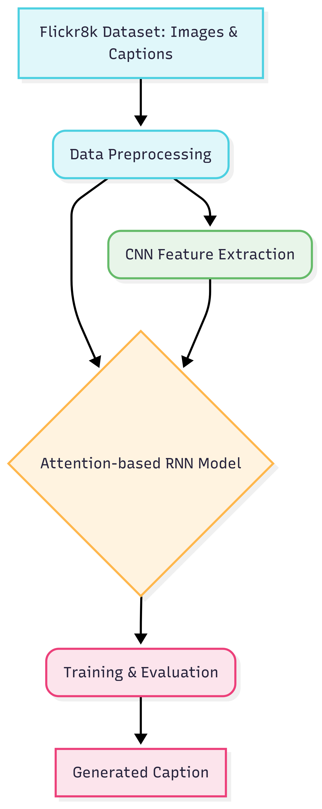

# Image Captioning with CNN-RNN and Attention Mechanism

## 1. Purpose & Overview

This project implements an end-to-end deep learning model to automatically generate descriptive captions for images. The model combines a Convolutional Neural Network (CNN) for image feature extraction and a Recurrent Neural Network (RNN) with an attention mechanism for generating sequential text data.

The primary motivation is to explore the synergy between computer vision and natural language processing. By using an attention-based architecture, the model can dynamically focus on the most relevant parts of an image while generating each word of the caption, leading to more contextually accurate descriptions.

---

## 2. Solution Workflow

The overall pipeline for this project is illustrated below:

<p align="center">
  <a href="doc/architecture_diagram.png">
    
  </a>
</p>


**Explanation of the Workflow:**

1. **Flickr8k Dataset** → The dataset provides both images and corresponding captions.
2. **Data Preprocessing** → Captions are tokenized and cleaned, images are resized and normalized.
3. **CNN Feature Extraction** → A pre-trained InceptionV3 model extracts image features.
4. **Attention-based RNN Model** → The extracted features are passed to a GRU-based RNN with attention to generate captions word-by-word.
5. **Training & Evaluation** → The model is trained and evaluated using BLEU scores.
6. **Generated Caption** → Final descriptive captions are produced for unseen images.

This flow ensures that the image context is effectively captured and translated into natural language.

---

## 3. Highlights & Features

✨ **Key Features:**

* **Encoder-Decoder Architecture:** InceptionV3 encoder + GRU decoder.
* **Bahdanau Attention:** Focuses on important image regions for each word.
* **Text-to-Speech:** Converts captions into audio using gTTS.
* **Visualization:** Attention heatmaps for interpretability.
* **Dataset:** Trained on Flickr8k.

---

## 4. Installation & Setup

```bash
# Clone repository
git clone https://github.com/your-username/your-repository-name.git
cd your-repository-name

# Create virtual environment
python3 -m venv venv
source venv/bin/activate   # For Unix/macOS
# OR
.\venv\Scripts\activate    # For Windows

# Install dependencies
pip install -r requirements.txt
```

Dataset: Download [Flickr8k](https://www.kaggle.com/datasets/adityajn105/flickr8k) and place under `dataset/`.

---

## 5. Usage Examples

* Train the model using `training_cnn_rnn_model.ipynb`.
* Use pre-trained models from `models/` for inference.

```python
caption = evaluate("path/to/your/image.jpg")
print("Predicted Caption:", caption)
```

---

## 6. Repository Structure

```
.
├── doc/
│   ├── architecture_diagram.png
│   └── PROJECT_DOC.md
├── models/
│   ├── encoder.keras
│   ├── decoder.keras
│   ├── attention.keras
│   └── tokenizer.pkl
├── dataset/
├── requirements.txt
└── training_cnn_rnn_model.ipynb
```

---

## 7. Technologies & Requirements

* Python 3.8+
* TensorFlow 2.x, Keras, NumPy, Pandas, Matplotlib, Seaborn
* gTTS, Pillow, WordCloud, scikit-learn, NLTK

---

## 8. Contributing Guidelines

1. Fork the repo.
2. Create a feature branch.
3. Commit and push changes.
4. Open a Pull Request.

---

## 9. License

MIT License – see [LICENSE](LICENSE).

---

## 10. Acknowledgements

* Flickr8k dataset creators.
* Google for InceptionV3.
